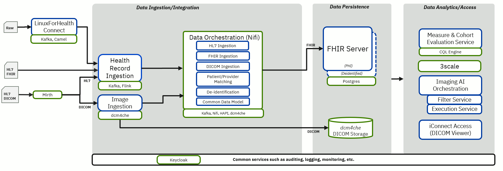

Below is a diagram of the reference implementation for Alvearie, which is initially focused on providing a clinical data integration pipeline that enables 
aggregation of clinical data to enable interoperability and data analytics.

Blue: current or future Alvearie component
 
Green: other open source projects

