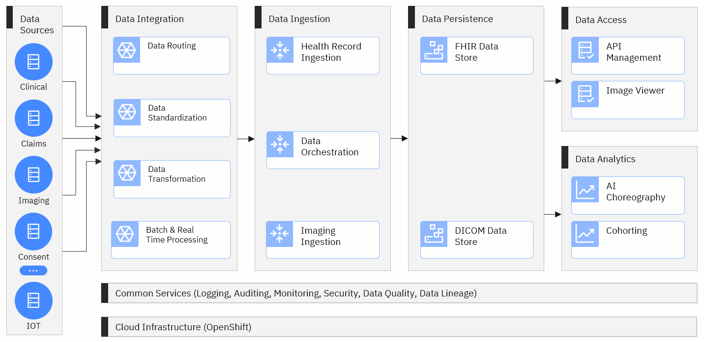
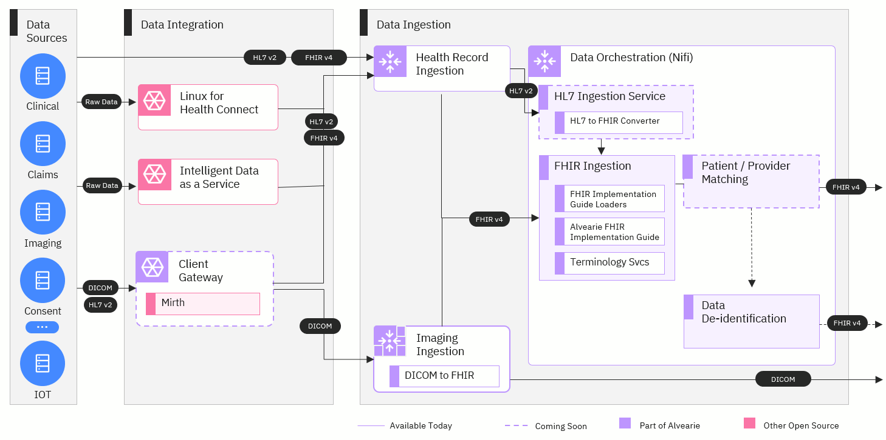

### Conceptual Architecture

Project Alvearie is a collection of components that can be combined to build custom data pipelines and other solutions 
that can help organizations improve the flow of health data. These components will move the data through five key stages.

These stages include data integration, data ingestion, data persistence, data access and data analytics. There will also be 
two layers that are used across all of the stages: cloud infrastructure and common services.

Let's explore the specific technologies that will be used in each stage.

**Cloud Infrastructure**

Our ultimate goal is for Alvearie to be cloud agnostic. To achieve that, we'll be building all the components of Alvearie on an OpenShift infrastructure. OpenShift provides the flexibility needed for Alvearie to work on any cloud platform, so developers and healthcare organizations can work with services they trust and know deeply.

**Common Services**

This layer will include important features that most organizations need for managing health data. These services will include auditing, 
logging, security management, data quality and lineage and other services shared across each stage of Alvearie. 

### Data Integration and Ingestion Architecture 

### Data integration

The data integration stage will be the starting point for any data coming into Alvearie that isn't already in a standard 
format like FHIR or DICOM. This stage will provide a single front door for incoming data and will transform raw data into standard 
formats that can be used by Alvearie. Key components include:

  - **Linux for Health Connect:** [Linux for Health](https://linuxforhealth.github.io/docs/) is an operating system that can be run where the data is stored, either on-premises or in the cloud, and used to export the data into Alvearie.

  - **Intelligent Data as a Service:** This [open source framework](https://connectedhealth-idaas.io/) for integrating health data from Red Hat will complement Alvearie by making it easier for health care systems to integrate with the Alvearie environment.

  - **Client gateway**: The client gateway will provide a path for data to be standardized and combined in a batch before sending to Alvearie. This component will be based on an open source integration engine called [Mirth](https://github.com/nextgenhealthcare/connect).

###  Data ingestion

The next stage that data will travel through is the data ingestion stage. Here, the records will be ingested by 
Alvearie and pass through several orchestration steps that provide some additional data transformation and standardization 
before the data is stored in a database. For this stage, we'll be using [Apache NiFi](https://nifi.apache.org/), an open source technology that can efficiently 
process and distribute large quantities of data. The components for this stage include:

  - [Health record ingestion](https://alvearie.github.io/HRI/): All incoming data in FHIR and HL7 v2 formats will be sent to HRI where it will be audited, logged, and routed to Nifi for orchestration.

  - [Imaging ingestion](https://github.com/Alvearie/imaging-ingestion): Imaging data in the form of DICOM will be received by this component.  The images will be persisted in a configured DICOM storage component, and metadata about the images will be passed into Nifi for orchestration.

  - [FHIR ingestion](https://github.com/Alvearie/hri-pipeline-adapters): Some additional transformation of FHIR records will be conducted so that all FHIR records conform to Alvearie's common data model. When the records are in this common format, they can either be stored in a database or transformed further with additional data orchestration components like de-identification or patient and provider matching.

  - **Alvearie FHIR Implementation Guide:** This FHIR Implementation Guide extends the FHIR v4 guide and provides additional profiles to enable analytics, person matching and other features.

  - **Patient and provider matching:** This component will identify unique patient and provider records so that duplicate records can be merged or linked.

  - [Data De-identification](https://github.com/Alvearie/de-identification): Data that is de-identified is very valuable for conducting research or tracking performance with analytics. With this component, records can be de-identified then stored in a database for other tools to access it.

### Data Persistence, Access and Analytics Architecture

### Data persistence

Once the data is fully integrated and transformed into FHIR format, it will need to be stored. Because different organizations 
have different requirements and goals, this stage will be configurable and provide a few different options for storing data. 
Here are some of the options that will be included:

  - [IBM FHIR server](https://ibm.github.io/FHIR/):  This open source server provides a data store for FHIR resources in either IBM DB2 or Postgres and HTTP APIs for storage and retrieval.

  - [Dcm4che DICOM storage](https://www.dcm4che.org/): Imaging data will be stored in a database using an open source clinical image archive called Dcm4che.

  - **Relational data warehouse**: Organizations will have the option to use a relational data warehouse if they want a more traditional way to store their data and connect it to business applications.

  - **Parquet data store**: The Parquet storage format can be used by organizations that need that structure for running analytics applications.

### Data access

Alvearie will be able to serve the data to APIs and other applications during this stage. This stage will ultimately be when most 
external applications connect with Alvearie to retrieve the standardized data. The connections we're planning to build include:

  - [3scale](https://www.3scale.net/): APIs can connect through this component to deliver data to external applications. 3scale is an open source API gateway supported by Red Hat.

  - **SMART on FHIR and CDS Hooks**: [SMART on FHIR](https://smarthealthit.org/) is a free, open standards API that provides access to FHIR data and [CDS Hooks](https://cds-hooks.org/) is an open API for clinical decision support. These APIs can be used for data requests from a variety of applications, ranging from smartphone apps to enterprise analytics.

### Data analytics

Often, additional steps need to be taken to prepare data for analytics and research. This stage in Alvearie will offer services and components that can make the standardized data usable for artificial intelligence (AI) applications, creating patient cohorts and other healthcare-specific use cases. The analytics components include:

  - [Cohort & Quality Measure service](https://alvearie.github.io/quality-measure-and-cohort-service/): This service will provide the ability for patient cohorts to be defined and retrieved using Clinical Quality Language. This service will be valuable for researchers and healthcare leaders who want to learn more about specific patient populations.

  - [Kubeflow](https://www.kubeflow.org/): This open source project provides a portable way to deploy machine learning workflows on kubernetes. 

  - **Dashboards**: Analytics dashboards from various vendors can be connected to data storage through this component to provide organizations with their most recent data. 

  
