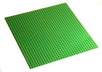
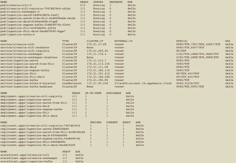
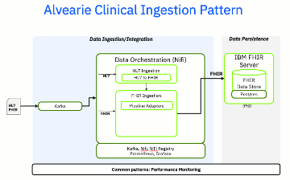
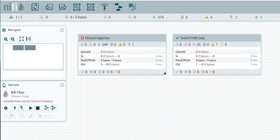
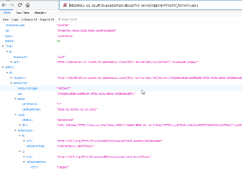

By Luis A Garcia and David L Ranum &nbsp;&nbsp; | &nbsp;&nbsp; Published February 9, 2021 (updated August 10, 2021)

### Introduction

The increasing digitization of healthcare records has made it more important to have a set of technologies and infrastructure that enable healthcare organizations to effectively create, store, transform, exchange, and consume these records. This post demonstrates how it is possible to build a reference implementation for processing healthcare records that addresses several common use cases, using only open source technologies.
This post introduces the Alvearie Clinical Ingestion Pattern, a reference implementation to ingest, process and store clinical records using existing healthcare record standards. The pattern fulfills several design considerations that will be outlined in the next section and that can be extended to implement typical healthcare record use cases. It is built using open source technologies and a Helm Chart is provided in order to facilitate its deployment on a Kubernetes cluster, running potentially on any public or private cloud.

### Design Considerations

As healthcare records have become more digitized, there have been several steps made in the right direction to facilitate working with those records and some fundamental problems have already been solved. For example, the previously disparate set of data representation formats used by the various healthcare organizations made it harder to interoperate, however more organizations agree on a standard way to represent and exchange these healthcare records as a result of [Health Level Seven International (HL7)](https://www.hl7.org) creating the [Fast Healthcare Interoperability Resources (FHIR)](https://www.hl7.org/implement/standards/product_brief.cfm?product_id=491) specification. While agreeing on a standard for exchanging data is crucial to creating a healthcare records processing pipeline, it is only step one. In this section we try to discuss and solve some of additional aspects needed in order to process healthcare records effectively.

There are several non-functional characteristics that need to be considered in order to build a true healthcare records processing pattern that will be able to meet the challenges of the modern healthcare organization. Those characteristics include:
-	Cloud based: It should be a native cloud application with all the benefits that entails.
-	Extensible: It should be possible for users to extend it to accomplish additional use cases on top of the basic functionality provided by the pattern.
-	Flexible: It should be possible for users to modify comprising elements of the pattern and replace them with elements deemed better suited for the users’ purposes, i.e. a “bring your own” (BYO) service model.
-	Open: It should not create vendor lock-in on any given cloud or technology, in other words it should be a multi-cloud application.
-	Scalable: It should scale as necessary to meet the user’s data performance and throughput needs.

From a functional perspective, a healthcare records processing pattern needs to allow its users to input healthcare records of multiple kinds using some of the more commonly used formats, e.g. FHIR v4 and HL7. The mechanism to accept records should allow for high throughput and the records should be persisted for traceability purposes. Multiple input modalities may be useful, for instance input via a messaging framework and over HTTP. The records should flow through an ingestion pipeline that would normalize the data, validate it, potentially transform it and ultimately store it. Appropriate logging, resiliency, error reporting and metrics should be maintained throughout the process.

In general, processing healthcare records falls within the realm of what is known as data integration, which is the process of combining data from different sources and providing users a unified view of said data. Data integration use cases may involve non-engineering teams, therefore it is a design consideration of the pattern covered in this post, to provide non-engineering teams with a simple way to extend and modify the data flows.
 
### Clinical Data Ingestion Pattern

The entire pattern is built using open source technologies, and if needed it could be expanded in functionality and scope using other components, proprietary or open source. The following open source technologies are used in the framework:
- [Apache NiFi](https://nifi.apache.org) a platform for automating and managing the flow of data between disparate systems.
- [Apache NiFi Registry](https://nifi.apache.org/registry.html) a complementary application that provides a central location for storage and management of shared resources across one or more instances of Apache NiFi.
- [Apache Kafka](https://kafka.apache.org) a distributed streaming platform for publishing, subscribing, storing and processing streams of records.
- [IBM FHIR® Server](https://github.com/IBM/FHIR) a modular Java implementation of version 4 of the HL7 FHIR specification with a focus on performance and configurability.
- [Prometheus](https://prometheus.io) is an open source monitoring and alerting tool that is widely adopted across many enterprises, that monitors targets by scraping or pulling metrics from endpoints and stores the metrics in a time series database.
- [Grafana](https://grafana.com) is an open source tool for data visualization and monitoring. Data sources such as Prometheus can be added to Grafana for metrics collection. It includes powerful visualization capabilities for graphs, tables, and heatmaps.

The foundation of the pattern is **Apache NiFi**. Apache NiFi provides a graphical user interface in the form of a canvas for data integrators to build data processing workflows using what are known as “processors.” NiFi comes out of the box with multiple processors that allow for data input and output to and from various sources, and for transforming the data into multiple data formats. Processors are linked together in such a way that the output of one becomes the input to the other, and it is in this manner that processor groups of increasing complexity can be built.

Once a sufficiently complex and functional group of processors that achieves a specific purpose is built, it can typically be managed independently. Think of it as how a class, a method or a function can be abstracted out in code and managed independently as a utility. These modular process groups in NiFi are stored and managed in a **NiFi Registry**. The NiFi Registry allows for version control and sharing of NiFi process groups, and it is backed by a Github repository where a team can be continuously delivering process group updates or new process groups to be consumed by a NiFi server user. The NiFi Registry is the second element of this pattern, and it is used to deliver the various NiFi processors used by the ingestion pattern. You can think of the NiFi canvas and NiFi Registry respectively as a big user-friendly empty LEGO board and a bag of working LEGO pieces that you will use to build structures on your board.

 &nbsp;&nbsp;  


Now, in order to get data flowing in and out of the data pipeline we need a mechanism that allows for processing of the data flowing through the pipeline in a way that is:
- Continuous, such that users don’t need to wait for the pipeline to finish processing some previous data before they can submit new data
- Asynchronous, such that users don’t need to wait synchronously for data to be fully processed since processing of data will likely take time
- Reliable, such that users know that once the data has been accepted it will be processed and not lost
- Durable, such that users can keep track of the raw data they have submitted into the pipeline for traceability purposes as long as necessary.

**Apache Kafka** is an open source events stream framework that addresses these characteristics. Upon deployment, the ingestion pattern begins to listen to a preconfigured Kafka topic.  When data is posted to that topic, it is automatically picked up by the framework and is then ingested.

Clinical data that is posted to the Ingestion Pattern typically needs to be processed in various ways. Processing may include:
-	Data Validation: Ensuring that the clinical data being ingested adheres to some conventions, standards or schemas. For instance, ensure the patient clinical data being ingested adheres to the FHIR US Core Profile.
-	Data Transformation: Transforming the clinical data into a different format or fixing any validation errors by ensuring the failing fields adhere to the expected schemas. For instance, transforming clinical data in HL7 format to FHIR, or adjusting a field to match some desired FHIR profile.
-	Data Enrichment: Processing the incoming clinical data with the purpose of enriching it with more data, or metadata, that will be useful for some consumers. For instance, running some natural language processor over patient clinical notes to try to discover new clinical information.
-	Data De-Identification: A very specific form of data transformation that removes any personally identifiable elements from clinical records.

The Ingestion Pattern includes pre-defined spots where one or more of these processing steps can be plugged in. It also includes a configuration mechanism to specify, on a per record basis, exactly which operations from the available processing steps to run. The pattern includes default implementations for some of these processors, but those can be replaced or complemented with others that can be plugged in to satisfy different user needs.

After the clinical data has been processed, it may need to be persisted. The standard for persisting clinical data is using a FHIR server. The Ingestion Pattern includes the **IBM FHIR Server** setup out of the box, which serves as the default target for ingested data. That FHIR server is exposed outside the pattern where clinical data consumers can access it using the FHIR Server REST APIs.

The Ingestion Pattern includes some optional activity monitoring for records that have been put through via **Prometheus** monitors over its existing components, as well as processor and memory usage of some of its components. It also includes monitors over the actual Kubernetes cluster where the pattern is running. All monitoring information can be visualized using the included **Grafana** instance.
 
### Installation

The instructions here assume that you have a working Kubernetes Cluster 1.10+ with Helm 3.0+.
The multiple components of the Ingestion Pattern can be deployed in a single step on a **Kubernetes** Cluster using the Alvearie Ingestion **Helm** chart. The chart performs all the steps necessary to deploy the Ingestion Pattern, ensure that there is connectivity between its various elements, set up the NiFi canvas with the corresponding processors, and initialize the necessary components. This greatly simplifies the startup process.

The following simple steps are necessary in order to run the Alvearie Clinical Ingestion Pattern:

1.	Check out the code

	```
	git clone https://github.com/Alvearie/health-patterns.git
	cd health-patterns/helm-charts/health-patterns
	helm dependency update
	```

1.	Create a new namespace in your Kubernetes Cluster.  Please note that it is recommended that you create a new namespace before installing the chart.  This will help prevent the various artifacts it will install from mixing with other artifacts that might already be present in your Kubernetes cluster.  To create a new namespace called alvearie

  ```
  kubectl create namespace alvearie
  kubectl config set-context --current --namespace=alvearie
  ```

1.	Install the helm chart in your new namespace with a release name `ingestion`

   Before installing, we need to make a note about ingress.  We recommend exposing the services in this chart via ingress. This provides the most robust and secure approach. If you choose to expose services via port-forwarding, load-balancer, or other options, please be careful to ensure proper security.

	 Ingress requires a specific ingress class to be used. Different cloud providers rely on different ingress classes, so choose the one that matches your cloud provider. For example, some possible choices might be:

	    - IBM: public-iks-k8s-nginx
	    - Azure: addon-http-application-routing
	    - AWS: nginx

	 You will also need to provide a hostname for your ingress. What this is and how it gets created will be unique to your cloud infrastructure.

	 Once you know these values, use both of them to update the ingress section of the file `helm-charts/health-patterns/values.yaml` as shown below.
 	```
	  ingress:
	   enabled: &ingressEnabled true
	   class: &ingressClass <<classname>
	   hostname: &hostname <<external-hostname>>
	```

	 For example, to deploy in the IBM Cloud environment, you would add

	```
	 ingress:
	   enabled: &ingressEnabled true
	   class: &ingressClass public-iks-k8s-nginx
	   hostname: &hostname <<your-ibm-hostname>>
	```

	 Now we can install the chart using helm.

	```
	  helm install ingestion .  -f clinical_ingestion.yaml
	```


After running the commands above, you will see notes that give you information about the deployment, in particular, where the important services (e.g. FHIR, Nifi, expose-kafka) have been deployed.  If you query the Kubernetes environment using `$kubectl get all`, you will see that all the corresponding elements of the Ingestion Pattern will start to be laid out, and eventually all the Kubernetes resources will be up and running:



Architecturally, that helm install has deployed the following:


 
### Using the Ingestion Pattern
 
By default, there are three important external services exposed by the Alvearie Clinical Ingestion Pattern: NiFi, Kafka via expose-kafka, and FHIR. Again, as mentioned above, the urls for those services are provided in the deployment information.  Let’s go through them one by one and discuss their corresponding functionality.

Let’s start with the ingestion-nifi service: **https://<<external-hostname\>\>/nifi**



The NiFi canvas will show a pre-configured main process group called “Clinical Ingestion,” which is the entry point to the Ingestion Pattern’s NiFi components. From here you can add, remove, or modify ingestion processing elements, add new inputs or outputs, change the URLs to some of the other services, etc. You will also see a second process group called “Enrich FHIR Data” that provides data enrichment functionality to the pipeline.  This is currently configured to be included automatically by the Clinical Ingestion installation but could also be deployed stand-alone by providing the appropriate helm variation.

The Ingestion Pattern includes a Kafka broker that can be used to feed clinical data into the pattern, but before pushing the data in, let’s create some synthetic clinical data to push. Synthetic patient data can be generated using the SyntheaTM Patient Generator.  [Download Synthea](https://github.com/synthetichealth/synthea/releases/download/master-branch-latest/synthea-with-dependencies.jar) and run the following command (for more information on Synthea visit their [Github page](https://github.com/synthetichealth/synthea/releases/download/master-branch-latest/synthea-with-dependencies.jar)):
	
	
		java -jar synthea-with-dependencies.jar -p 10
	
	
The previous command will have created FHIR bundles for 10 patients with their clinical history and their corresponding medical providers.

Now that we have some test clinical data, let’s ingest it. The entry point into the clinical ingestion flow is a kakfa topic called ingest.clinical.in.  When we place data onto that topic, it will automatically be consumed and sent through the rest of the flow.  In order to place data on a kafka topic, we will use the expose-kafka service that was deployed as part of the install (the url is included in the deployment information).  This can be done with Postman, curl, or some other http tool.

For example, the curl command below will place the contents of the file `testpatient.json` (a patient FHIR bundle) on the `ingest.clinical.in` kafka topic.  At that point, the ingestion flow is listening for messages and will immediately take the new bundle and begin to process it.  You should see one bundle appear in the “success” state at the end of the flow.

	
	curl -X POST https://<<external-hostname>>/expose-kafka?topic=ingest.clinical.in  \
			--header "Content-Type: text/plain" \
			--data-binary  @<<pathtofile>>/testpatient.json
	

After posting the patient through Kafka, the patient will eventually be persisted in the FHIR server. From the list of services provided after the deployment, grab the deployment base url for the FHIR server. You can then query the list of FHIR resources using your browser or an HTTP client. For instance, for querying patients (Patient resources) you would do the following (using default credentials: *fhiruser*/*integrati0n*):

**https://<<external-hostname\>\>/fhir/Patient?_format=json**



### Conclusion

 The Alvearie Clinical Ingestion Pattern is not currently meant to be ready for production use out of the box, it is more of an implementation of a Reference Design, that can evolve into a reference implementation for production use. Still, an effective pattern for efficient clinical data ingestion enables advanced analytics and opens the door to a number of important healthcare use cases, including:

- Evaluating and improving the quality of care in patient populations
- Analyzing quality measures against federal regulations and guidelines
- Accelerating time-to-insight from data that supports clinical decision-making, pharmaceutical research, and more

The Alvearie Clinical Ingestion Pattern is fully open source and it’s built using open source technology, including the corresponding Helm charts needed to put it together and deploy it. Each of the subcomponents that comprise the pattern can be modified using the corresponding Helm deployment properties in order to meet the persistence, availability, scalability and security requirements of a production grade deployment.


<p/>
<p/>
<p/>
