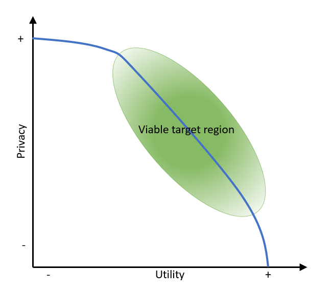

By Denis Ricard &nbsp;&nbsp; | &nbsp;&nbsp; Published June 2, 2021

Once any information is digitized and secured using methods such as encryption, firewalls and authorization mechanisms, the next logical step is to 
mine the data to gain insight. However, before any personal data can be used to support secondary purposes, applicable privacy laws that govern this 
personal data, such as HIPAA, GDPR, CCPA, PIPEDA, or others, must be understood and adhered to in addition to security requirements.

Primary Use of data is when usage of the data falls within the confines of the privacy law (as permitted use) and what the data subject consented to. 
In Primary Use cases, it's best practice to pseudonymize direct identifiers (DI), which consist of fields that uniquely identify an individual on their 
own, unless the use case specifically requires the data subject to be identifiable. It is important to note that encrypting identifiers may not suffice 
to de-characterize data as non-personal because encrypted fields are still considered to be private information under some privacy legal frameworks.

When source data are to be used for secondary purposes to the ones they were originally collected, they must first be de-identified or anonymized to a 
point where the risk of re-identifying data subjects in the data is very low. Different privacy laws define different criteria and technologies on how 
data must be processed to be sufficiently de-identified or anonymized. De-Identified or anonymized data typically falls outside the scope of the 
corresponding privacy legal frameworks and can be more readily shared, combined and mined as it is no longer considered to be personal information. 

In order to generate de-identified and anonymized data, in addition to the Direct Identifiers (DI) that may exist in the dataset, Quasi Identifiers 
(QI) - which consist of fields that, when combined with each other, can re-identify an individual - must also be protected. Adding quasi-identifying 
fields to a quasi-identifier progressively reduces the corresponding population that can be matched to an individual record and, therefore, increases 
the probability of a successful re-identification attack. Protection of QI fields can be achieved through different means, such as via data value 
generalization or perturbation to prevent the combined QI fields in records from being associated with unique or few individuals.


### Practical examples of re-identification protection

Encrypted personal information (PI) is still considered PI under some privacy legal frameworks and encrypting field values makes it harder to use 
the field for anything else than an equality predicate. As a result, even in privacy frameworks that allow encryption, this approach is not a good 
choice when dealing with QI fields that must be used in various and complex computations. QI fields are typically valuable in data analyses as they 
involve demographics, geographic locations, event dates, etc., that are associated with individuals, so their privacy protection should be performed 
in a utility-preserving way. At the other end of the spectrum, redacting field values removes any utility from those fields and can break applications 
that expect field data to be of a certain format.



Our goal is to reduce the re-identification risk under a viable threshold while preserving data attributes that are interesting to 
data scientists and algorithms that use the data. Let's take three specific examples to illustrate the point.

### 1 - Zip Code

HIPAA Safe Harbor has very specific requirements for US ZIP code handling. It allows to preserve the first 3 digits of the ZIP code but only if all 
ZIP codes covered by these three digits have an aggregate population that is larger than 20,000 people, or else it must be replaced with 000. As of 
the 2010 Census, 17 ZIP codes are restricted in such a way. With the Alvearie Data De-Identification server, the Safe Harbor requirement could be 
satisfied with the following utility-preserving options:

| Option  | Value  |
| ---------|--------|
| maskPrefixLength | 3 (default) |
| maskPrefixRequireMinPopulation |	true |
| maskPrefixMinPopulation |	20000 (default) |

When using HIPAA Expert determination, other options could be considered at the discretion of the expert. For example, generalizing to the 
first 3 digits unless the minimum population requirement of 15,000 is not met in which case, generalize to 2 digits. In this scenario, the 
following options would be used:

| Option   | Value  |
| ---------|--------|
| maskPrefixLength |	3 |
| maskTruncateIfNotMinPopulation |	True |
| maskPrefixMinPopulation |	15000 |
| maskTruncateLengthIfNotMinPopulation |	2 |

The Alvearie [Data De-Identification](https://github.com/Alvearie/de-identification) server allows the application of more than one data protection method to the same data element. This 
applies when multiple values are specified in the maskingProviders parameter of a rule. The data protection methods are applied in the 
sequence in which they are listed in the data de-identification configuration file. Here is an example that retrieves information about the 
state where an individual resides for selected US states. Starting with a US postal (ZIP) code it translates five-digit codes to three digits 
and then maps the result to states ME, CT, and Other. This is achieved by chaining the ZIPCODE provider with the GENERALIZE provider.

**ZIPCODE:** <br/>
Use default options

**GENERALIZE:**

| Source Value   | Target Value  |
| ---------|--------|
| 040,041,042,043,044,045, 046,047,048,049 |	ME |
| 060,061,062,063,064,065,066,067,068,069 |	CT |
| * |	Other |

### 2 - Birth date and Death date 

There is a multitude of generalizations, perturbations, obfuscation and boundaries that can be imposed on dates, timestamps and durations. 
Let's consider a case where the birth date (/Patient/birthDate) of an individual should be masked for individuals who died at 5 years of age or 
less. Here are the possible DATEDEPENDENCY masking provider utility preservation options that would be used with the Alvearie [Data De-Identification](https://github.com/Alvearie/de-identification) 
server to support such a case.

| Option   | Value  |
| ---------|--------|
| dateYearDeleteNDaysValue |	1825 (365*5) |
| datetimeYearDeleteNIntervalCompareDate |	/Patient/deceased |

Here is a common example following the HIPAA Safe Harbor method where dates are generalized to year and ages over 89 must be categorized as 
90 years or older. With the Alvearie Data De-Identification server, supporting such a case simply requires these options to be used with the 
DATETIME masking provider on a birthdate field. Note that an option also exists to generalize to month and year instead of year only.

| Option   | Value  |
| ---------|--------|
| generalizeYearMaskAgeOver90 |	True |

### 3 - Name

Name is a direct identifier and must be masked carefully. To maintain data utility with names, it is possible to replace names with fake names of the 
same gender with a certain amount of accuracy. Depending on the privacy framework we are working under, it can also be possible to select a replacement 
name with pseudo-randomness so that we achieve consistent replacement of the name as we see it repeating in the original dataset. The pseudo-randomness 
feature is not allowed in HIPAA Safe Harbor because the entire original value is hashed and used to select the pseudo-random feature. 
With the Alvearie [Data De-Identification](https://github.com/Alvearie/de-identification) server, the NAME masking provider would preserve gender for recognized given names with the 
following options. Note that for localization purpose, files with new names can be added to the project and selected through property files.

| Option   | Value  |
| ---------|--------|
| maskingAllowUnisex |	false (default) |
| maskPseudorandom |	false (default) |
| maskGenderPreserve |	true |

With all the possible permutations, varying data sets, evolving schemas, new regions or countries to support, each with different privacy rules, 
hardcoding these rules within an application is not a viable long-term solution. Also, exposing coding interfaces to cover this amount of change 
can be error-prone and problematic in healthcare-certified environments, where code changes require going over a costly verification and validation process. 

### Introducing the Alvearie Data De-Identification Server

The Alvearie [Data De-Identification](https://github.com/Alvearie/de-identification) server allows applications to strike the perfect balance between privacy and utility by providing a suite of 
utility-preserving masking providers. The rich configuration schema allows applications to support privacy frameworks from different regions and 
adapt to various dataset schemas without changing the code itself. Since the application is built with healthcare in mind, it contains common rules 
that experts tend to select. The generic masking providers also help to handle rare and unexpected data from other domains than healthcare.

### Creating a masking configuration from what we learned earlier

We can use some of the masking configuration ideas from the previous section to create a configuration file that the Alvearie Data De-identification 
server can use. The configuration has two main sections. The "rules" section defines masking rules using one of the supported masking providers 
along with the desired options. In the "json" section that follows, input fields are assigned to one of the previously defined masking rules. 
The "json" section also describes the schema of the input data as being FHIR records, and lists the supported resource type, which is 
"Patient" in this case. This resource type partitioning allows us to potentially define different masking rules for the same field as it appears 
in different resource types.

The masking configuration has a very rich set of features to allow solutions to strike the perfect balance between privacy and utility. 
Refer to the [Masking Configuration Overview](https://github.com/Alvearie/de-identification/blob/master/docs/masking-config-overview.md) for a more detailed look at masking configuration features such as 
JSON arrays, conditionals and internationalization support. 

```json
{
  "rules": [
    {
      "name": "MaskZipCode",
      "maskingProviders": [
        {
          "type": "ZIPCODE",
          "maskPrefixRequireMinPopulation": true
        }
      ]
    },
    {
      "name": "MaskBirthDay",
      "maskingProviders": [
        {
          "type": "DATETIME",
          "generalizeYearMaskAgeOver90": true
        }
      ]
    },
    {
      "name": "MaskFirstName",
      "maskingProviders": [
        {
          "type": "NAME",
          "maskGenderPreserve": true
        }
      ]
    },
    {
      "name": "MaskFamilyName",
      "maskingProviders": [
        {
          "type": "NAME"
        }
      ]
    },    
    {
      "name": "PHONE",
      "maskingProviders": [
        {
          "type": "PHONE"
        }
      ]
    }
  ],
  "json": {
    "schemaType": "FHIR",
    "messageTypeKey": "resourceType",
    "messageTypes": [
      "Patient"
    ],
    "maskingRules": [
      {
        "jsonPath": "/fhir/Patient/name/given",
        "rule": "MaskFirstName"
      },
      {
        "jsonPath": "/fhir/Patient/name/family",
        "rule": "MaskLastName"
      },
      {
        "jsonPath": "/fhir/Patient/telecom/value",
        "rule": "PHONE"
      },
      {
        "jsonPath": "/fhir/Patient/birthDate",
        "rule": "MaskBirthDay"
      },
      {
        "jsonPath": "/fhir/Patient/address/postalCode",
        "rule": "MaskZipCode"
      }
    ]
  }
}
```

### Using the Alvearie Data De-Identification Server

The fastest way to get started with the Alvearie Data De-Identification server is by using helm charts to deploy the server to a 
Kubernetes cluster of your choice. The latest instructions are available on [GitHub](https://github.com/Alvearie/de-identification/blob/master/de-identification-app/chart/README.md).

#### Pre-requisites
 
 - Kubernetes cluster 1.10+
 - Helm 3.0.0+
 - Jq 1.6+
 
#### Check out the code and install the chart

```
git clone https://github.com/Alvearie/de-identification.git
cd de-identification/de-identification-app/chart
helm install deid .
```

#### Test the newly created service with original message text:

```json
{
  "resourceType": "Patient",
  "id": "example",
  "address": {
    "postalCode": "10001"
  },
  "name": [
    {
      "use": "official",
      "family": "Leroy",
      "given": [
        "Peter",
        "James"
      ]
    },
    {
      "use": "usual",
      "given": [
        "Anna"
      ]
    }
  ],
  "telecom": [
    {
      "system": "phone",
      "value": "+1-3471234567",
      "use": "work",
      "rank": 1
    }
  ],
  "birthDate": "1974-12-25"
}
```

```
kubectl port-forward service/deid 8888:8080&

curl -k POST --header 'Content-Type: application/json' --header 'Accept: application/json' -d '{ 
"config":"{\"rules\":[{\"name\":\"MaskZipCode\",\"maskingProviders\": [{\"type\":\"ZIPCODE\",\"maskPrefixRequireMinPopulation\":true}]},{\"name\":\"MaskBirthDay\",\"maskingProviders\":[{\"type\":\"DATETIME\",\"generalizeYearMaskAgeOver90\":true}]},{\"name\":\"MaskFirstName\",\"maskingProviders\":[{\"type\":\"NAME\",\"maskGenderPreserve\":true}]},{\"name\":\"MaskFamilyName\",\"maskingProviders\":[{\"type\":\"NAME\",\"maskPseudorandom\":true}]},{\"name\":\"PHONE\",\"maskingProviders\":[{\"type\":\"PHONE\"}]}],\"json\":{\"schemaType\":\"FHIR\",\"messageTypeKey\":\"resourceType\",\"messageTypes\":[\"Patient\"],\"maskingRules\":[{\"jsonPath\":\"/fhir/Patient/name/given\",\"rule\":\"MaskFirstName\"},{\"jsonPath\":\"/fhir/Patient/name/family\",\"rule\":\"MaskFamilyName\"},{\"jsonPath\":\"/fhir/Patient/address/postalCode\",\"rule\":\"MaskZipCode\"},{\"jsonPath\":\"/fhir/Patient/telecom/value\",\"rule\":\"PHONE\"},{\"jsonPath\":\"/fhir/Patient/birthDate\",\"rule\":\"MaskBirthDay\"}]}}" , "data": ["{\"resourceType\":\"Patient\",\"id\":\"example\",\"address\":{\"postalCode\":\"10001\"},\"name\":[{\"use\":\"official\",\"family\":\"Leroy\",\"given\":[\"Peter\",\"James\"]},{\"use\":\"usual\",\"given\":[\"Anna\"]}],\"telecom\":[{\"system\":\"phone\",\"value\":\"+1-3471234567\",\"use\":\"work\",\"rank\":1}],\"birthDate\":\"1974-12-25\"}"], "schemaType": "FHIR" }' \
'http://localhost:8888/api/v1/deidentification' | jq "."
```

#### The output will look like this:

```json
{
  "data": [
    {
      "resourceType": "Patient",
      "id": "example",
      "address": {
        "postalCode": "100"
      },
      "name": [
        {
          "use": "official",
          "family": "Kole",
          "given": [
            "Jess",
            "Jimmie"
          ]
        },
        {
          "use": "usual",
          "given": [
            "Gillian"
          ]
        }
      ],
      "telecom": [
        {
          "system": "phone",
          "value": "+1-3475353644",
          "use": "work",
          "rank": 1
        }
      ],
      "birthDate": "1974"
    }
  ],
  "audit": null
}
```

#### Observations:

 - The postal code was reduced to three digits.
 - The first names have their gender preserved where it could be identified.
 - The family name is replaced with a consistent pseudo-random value.
 - The phone number has the country and area code preserved but other digits randomized so applications expecting the format to be valid will still work.
 - The birth date has been generalized to the year alone.

### Typical Usage pattern

Typically, the Alvearie De-Identification server is used after the raw input data has been consolidated so that input fields have a consistent and 
meaningful value. The output data having the desired trade-off between privacy and usability is ready to mine. For cases where the schema is highly 
variable and new fields with PI may suddenly appear, the "defaultNoRuleResolution" configuration parameter can be set to "true" so that any input 
field without a specific rule association is nullified in the output. Create a rule that uses the MAINTAIN masking provider and assign it to any 
field that must be sent through untouched.

### Conclusion

Now that you know the basics of data de-identification, you can expand on the configuration above to de-identify more resourceTypes. 
You can also connect more components of the Alvearie project together as described in the [Clinical Data Ingestion Pattern](https://alvearie.io/blog/clinical-records-ingestion-pattern) blog.


<p/>