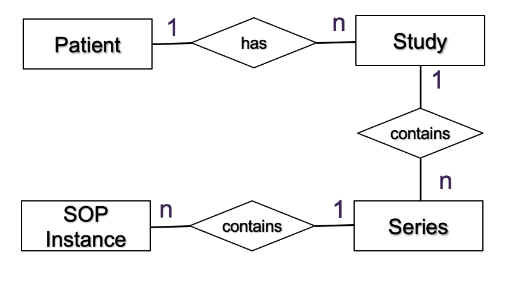
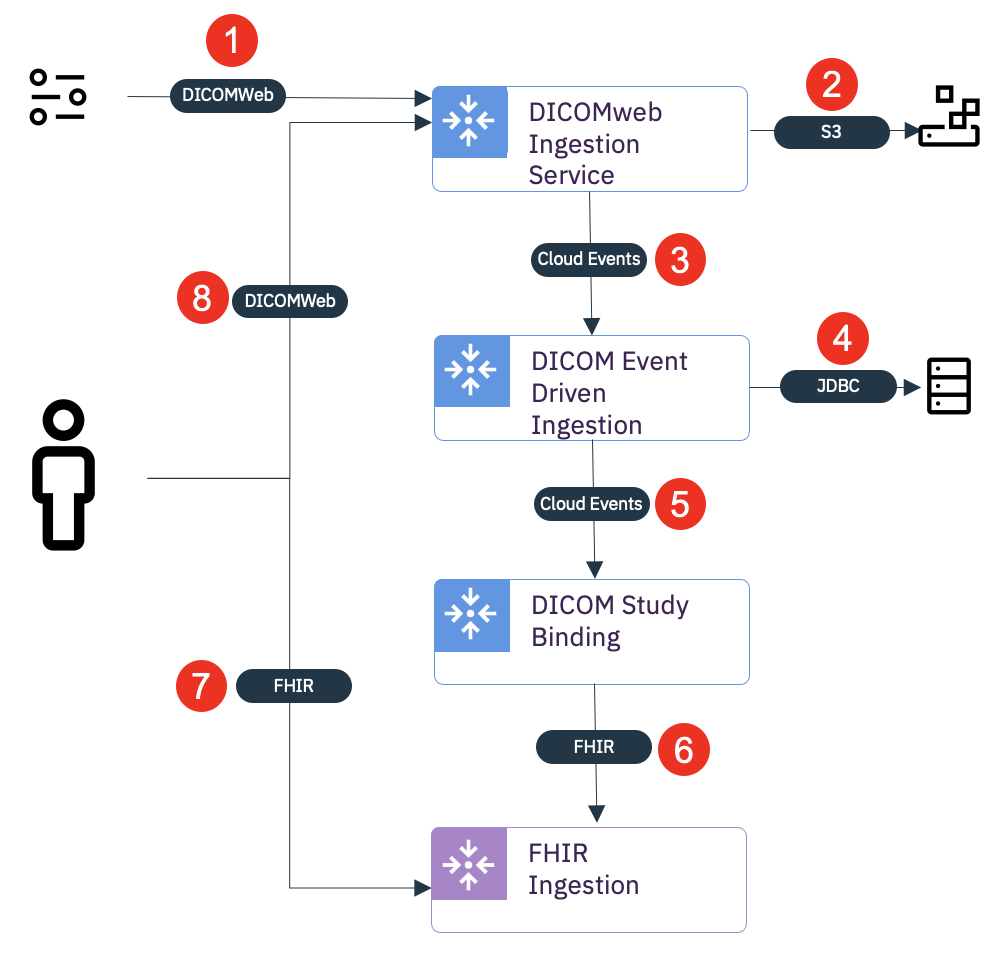
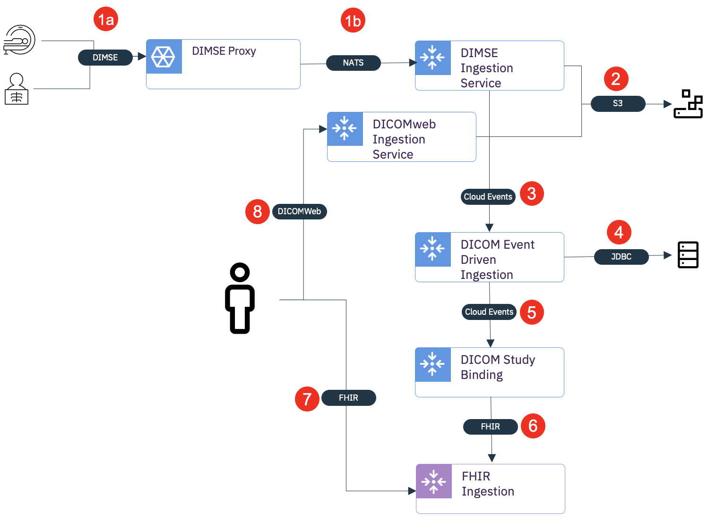

By Richard Duggan &nbsp;&nbsp; | &nbsp;&nbsp; Published June 17, 2021

The Alvearie _Clinical Data Ingestion and Enrichment_ health patterns capture how to both ingest and enrich HL7 and 
FHIR data destined for a FHIR repository. Medical imaging study data, however, is stored in an alternate infomatics 
system than HL7/FHIR clinical data. Commonly, a _Picture Archiving and Communication System_ (PACS) would efficiently store the 
medical imaging data and provide access to that data using _Digital Imaging and Communications in Medicine_ (DICOM) standards. 
The [Alvearie Imaging Ingestion](https://github.com/Alvearie/health-patterns/tree/main/clinical-ingestion) 
component provides a number of subcomponents for ingesting, managing, and routing medical imaging 
studies. This post explores how to use a subset of those subcomponents to augment the _Clinical Data Ingestion and 
Enrichment_ health patterns with medical imaging study information.

### What is DICOM

DICOM is an extensive specification for both the medical imaging data and the communication of said data. For the 
purposes of this post, we can take a narrow view of the DICOM information model as essentially a four-tiered 
hierarchical structure. At the root is the _patient_. A patient has a number of imaging _studies_, each study 
consists of a number of modality specific series, and a series is comprised of an ordered list of _Service-Object 
Pair Instances_ (SOP Instances). A SOP Instance may be a single image, a number of image frames, a structured report, 
an audio recording, etc.

A DICOM study is unbounded. As an unbounded entity, each SOP Instance is an independently managed observation 
containing all of the reference information to establish its location within the hierarchical DICOM model. 
This is generally referred to as a _Composite Object Instance_. As a consumer of DICOM, we never know when new SOP 
Instances will be created or sent. For example, as a patient participates in a medical imaging study they move 
between modalities. A modality establishes the patient orientation in 3D space, and captures a number of SOP 
Instances (i.e. images) as an ordered series within the established orientation. Each modality sends the collected 
SOP Instance to the PACS at different points in time. As the SOP Instances arrive at the PACS, they are organized 
into the DICOM information model.

### Capturing DICOM with FHIR resources

FHIR captures a patient's medical imaging studies with _ImagingStudy_ resources. The _ImagingStudy_ resource provides a 
metadata model that mirrors a subset of the previously described DICOM hierarchical (study, series, SOP instance) 
information model. As metadata, it does not include the raw SOP Instance content. The _ImagingStudy_ resource uses the 
_Reference_ resource to indicate where the SOP Instances are stored within the DICOM infomatics systems. Therefore, 
having a FHIR repository is not sufficient for managing all of the information in the study. We need a separate repository 
for storage, and services for retrieval, of SOP Instances that are referenced from the _ImagingStudy_. A user-agent interacting 
with patient FHIR _ImagingStudy_ resources is provided the hierarchical metadata of the study but must work with referenced 
services to retrieve the SOP Instances from the repository.

### Alvearie Imaging Ingestion Approach

Alvearie Imaging Ingestion is a real-time, event-driven subsystem for ingesting, managing, and routing DICOM SOP Instances. 
Beyond that, it also provides the ability to conveniently interact with DICOM at the study level as opposed to the instance; 
as is the case with the FHIR _ImagingStudy_. The Alvearie Imaging Ingestion component achieves this by providing a number of 
subcomponents, each as an independent Kubernetes Custom Resource for deployment and management. This subcomponent approach 
allows for custom deployments of incremental medical imaging capabilities to enable a number of different use cases. The 
subcomponents are designed to work together, providing DICOM standards-based request-response services on the edges with the 
individual components interacting in an event-driven pattern within the core. It is simple to create highly elastic topologies 
of resilient subcomponents that incrementally scale up and down with demand. Many more details are provided within the 
[Alvearie Imaging Ingestion](https://github.com/Alvearie/imaging-ingestion/) GitHub pages.

### Simplified Ingestion Topology

In order to add DICOM data to the _Clinical Data Ingestion and Enrichment_ health patterns, we essentially have four requirements:

1.	We need a standards-based DICOM service for ingesting the SOP Instance data.
2.	We need a runtime to manage the SOP Instances and form an opinion of when a study is complete. This runtime should create a revisioned history of studies as they change over time.
3.	For each revision of an imaging study, we need to generate and publish FHIR _ImagingStudy_ resource to the clinical enrichment pipeline.
4.	We need a service for retrieving the previously ingested SOP Instances from references in the generated FHIR _ImagingStudy_.

A simplified, but limited, approach could be to provide the following topology and resulting data flow:

DICOM SOP Instances are ingested into the system through the _DICOMweb_ STOW-RS REST service (1) provided by the **DICOMweb Ingestion 
Service**. As SOP Instances are successfully stored into an S3 bucket (2), Cloud Events (3) are generated for the next subcomponent 
in the pipeline; the DICOM Event Driven Ingestion. The **DICOM Event Driven Ingestion** captures a manifest of all the SOP Instances 
ingested within the pipeline, forming a hierarchical DICOM study model (4) as well as an opinion of whether a complete study has 
been ingested. Once the DICOM Event Driven Ingestion determines a study has likely been completely ingested, it generates a Cloud 
Event (5) for that first revision of the imaging study. The **DICOM Study Binding** subscribes to the study-based Cloud Events and 
generates a FHIR _ImagingStudy_ resource for the imaging study and publishes to (6) the FHIR Ingestion service. A user-agent can 
retrieve the _ImagingStudy_ resource (7), containing the DICOM hierarchy of the imaging study. Each SOP Instance within the 
_ImagingStudy_ is represented as an endpoint reference to the DICOMweb Ingestion service where it was originally ingested. 
The SOP Instances can subsequently be retrieved using the DICOMweb WADO-RS (8) provided with that DICOMweb Ingestion Service.

### Extended Ingestion Topology

In the real world, medical imaging centers are less likely to use DICOMweb and much more likely to use DICOM Message Service 
Element (DIMSE) services for communication of DICOM data. Specifically, images are stored using a DIMSE C-Store composite 
operation as opposed to the DICOMweb STOW-RS in the simplified topology. As such, we need to extend the previously defined 
Simplified Approach to enable a bridge from DIMSE to the ingestion services.

The resulting topology is identical to the Simplified Approach with the exception that we introduced the **DIMSE Ingestion Service** 
for processing DIMSE C-STORE operations (1b). Also, we have added a **DIMSE Proxy** that acts as a DIMSE Application Entity (AE) to 
directly integrate with the existing DIMSE based communication systems within the medical imaging center. The DIMSE proxy and 
DIMSE Ingestion subcomponents use a [NATS](https://nats.io/) messaging service to bridge the DICOM to a multi-zone regional cloud deployment.

### Conclusion

The _Imaging Ingestion_ component provides several different subcomponents for ingesting, managing, and routing DICOM SOP Instances 
as well as the associated medical imaging studies. These specialized subcomponents can be composed into custom, fit for purpose, 
use-case driven topologies. In this post, we have explored how using a subset of the provided components can be used to extend 
the _Clinical Ingestion and Enrichment_ health patterns to include DICOM medical imaging data. Detailed documentation and deployment 
details of each of the subcomponents is readily available within the [Alvearie Imaging Ingestion](https://github.com/Alvearie/imaging-ingestion) GitHub pages.

