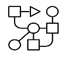

import HomepageTemplate from 'gatsby-theme-carbon/src/templates/Homepage';
export default HomepageTemplate;
import Img from 'gatsby-image';

Project Alvearie is an open-source project bringing together contributors from across the health and life sciences ecosystem for 
collaboration around common and pervasive challenges in creating applications, analytics, or software that uses health data. Together, 
our mission is to build a set of an extensible, modular and scalable multi-cloud data and analytics components that can help organizations 
improve care delivery and operate more efficiently in a highly regulated environment.

Developers can access a collection of assets capable of ingesting and orchestrating FHIR, HL7, DICOM, and X12, and leveraging Apache 
Spark and Flink for distributed big data processing and analytics. Developers can also leverage or contribute to reference implementations 
that highlight how to combine various technologies into meaningful patterns for healthcare.

## Key Objectives

<Row>
  <Column colMd={4} colLg={4} noGutterMdLeft>
    <ArticleCard
      title="Transform healthcare technology through an open ecosystem with composable services aligned with open standards delivered via cloud agnostic open technology">

 

</ArticleCard>
  </Column> 
  
  <Column colMd={4} colLg={4} noGutterMdLeft>
    <ArticleCard
     title="Build an extensible, modular, scalable set of components that can be pipelined aligned with common industry-standard data models">

 

</ArticleCard>
  </Column>
  
  <Column colMd={4} colLg={4} noGutterMdLeft>
    <ArticleCard
     title="Be the leading reference implementation that highlight how to combine various technologies into meaningful patterns for healthcare">

 

</ArticleCard>
  </Column>
</Row>

## Features

<Row>
  <Column colMd={1} colLg={2} noGutterMdLeft>

<ResourceCard title="Health Data Connectivity" actionIcon="" aspectRatio="1:1">
</ResourceCard>

  </Column>
  <Column colMd={7} colLg={10} noGutterMdLeft>

Connect your healthcare data where ever it exists today
<ul>
<li>Connectivity across embedded devices, multi-cloud and LinuxONE</li>
<li>Data acquisition, integration, routing</li>
<li>Real-time and batch processing</li>
</ul>

  </Column>
</Row>
<Row>
  <Column colMd={1} colLg={2} noGutterMdLeft>

<ResourceCard title="Health Standards & Data Models" actionIcon="" aspectRatio="1:1">
</ResourceCard>

  </Column>
  <Column colMd={7} colLg={10} noGutterMdLeft>

Support for industry standard specifications
<ul>
<li>FHIR</li>
<li>HL7</li>
<li>DICOM</li>
<li>X12</li>
<li>Data conversion and normalization</li>
</ul>

  </Column>
</Row>

<Row>
  <Column colMd={1} colLg={2} noGutterMdLeft>

<ResourceCard title="Customizable Data Enrichment" actionIcon="" aspectRatio="1:1">
</ResourceCard>

  </Column>
  <Column colMd={7} colLg={10} noGutterMdLeft>

Enrich your data
<ul>
<li>De-identification of health data to support GDPR, HIPAA, CCPA and other privacy frameworks</li>
<li>Easily customize and extend data flows with Apache Nifi</li>
<li>Capture the full lineage of your data as it flows through the system</li>
</ul>
  </Column>
</Row>

<Row>
  <Column colMd={1} colLg={2} noGutterMdLeft>

<ResourceCard title="Access and Analytics" actionIcon="" aspectRatio="1:1">
</ResourceCard>

  </Column>
  <Column colMd={7} colLg={10} noGutterMdLeft>

Enable insights from your data through analytics
<ul>
<li>Evaluate quality measure and cohort specifications against a target patient data set</li>
<li>Provide access to your data via standard APIs such as the FHIR specification</li>
</ul>

  </Column>
</Row>

## Open source Community Projects

Alvearie is utilizing key, established open source projects and communities, including:
  - OpenShift
  - Apache Spark
  - Apache Nifi
  - Apache Kafka
  - Apache Camel
  - Apache Flink
  - NATS
  - dcm4che
  - Mirth
  - HAPI
  - CQL Engine

