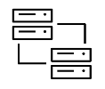

## Use cases supported by Alvearie

<Row>
  <Column colMd={4} colLg={6} noGutterMdLeft>
    <ArticleCard
      title="When healthcare data can be exchanged between disconnected systems, it's easier to draw the insights that feed innovative solutions for patient care, consumer experiences, clinical breakthroughs, and business efficiency. Join developers working to improve health data interoperability through projects focused on data ingestion, enrichment and more.">

 
Interoperability

</ArticleCard>
  </Column> 
  <Column colMd={4} colLg={6} noGutterMdLeft>
    <ArticleCard
      title="Need description. Platform for ingestion of clinical and imaging data for patients which enables an AI workflow for radiologists">

 
AI Imaging Clearing House

</ArticleCard>
  </Column> 
</Row>

## Health Patterns

<Row>
  <Column colMd={4} colLg={6} noGutterMdLeft>
    <ArticleCard
      title="This reference implementation will focus on the process of accepting data from a source system (EMR, Data Warehouse, etc), 
      performing the necessary transformation & normalization and storing it in a persistence layer. Initial data formats supported will 
      include HL7, FHIR and DICOM and will persist the data in an industry standard FHIR Server and DICOM image store."
      actionIcon="launch" href="https://github.com/Alvearie/health-patterns/blob/main/docs/roadmap.md#1-clinical-data-ingestion">

 
Clinical Data Ingestion

</ArticleCard>
  </Column> 
  <Column colMd={4} colLg={6} noGutterMdLeft>
    <ArticleCard
      title="Enrichment of clinical data through the use of Natural Language Processing (NLP), de-identification, or other services."
      actionIcon="launch" href="https://github.com/Alvearie/health-patterns/blob/main/docs/roadmap.md#2-clinical-data-enrichment">

 
Clinical Data Enrichment

</ArticleCard>
  </Column> 
</Row>