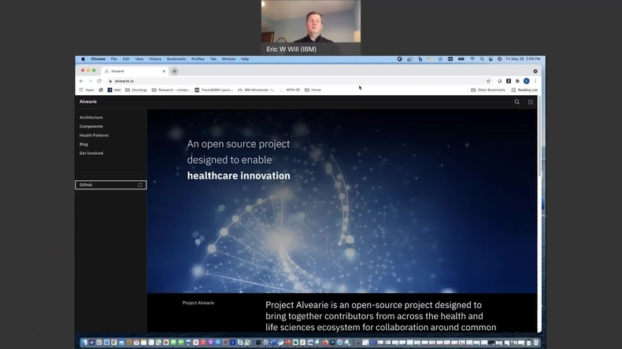

## Clinical Ingestion Videos

The following videos introduce and guide you through the details of the Alvearie Clinical Ingestion pattern.

<Row className="image-card-group">
<Column colMd={4} colLg={4}>
<ImageCard  aspectRatio="4:3" iconColor="dark" href="https://mediacenter.ibm.com/media/t/1_bus1xkhe">

Welcome to Alvearie & patterns

</ImageCard>
</Column>

<Column colMd={4} colLg={4}>
<ImageCard aspectRatio="4:3" iconColor="dark" href="https://mediacenter.ibm.com/media/t/1_qqw3a3nq">

Deploying clinical ingestion

</ImageCard>
</Column>

<Column colMd={4} colLg={4}>
<ImageCard aspectRatio="4:3" iconColor="dark" href="https://mediacenter.ibm.com/media/t/1_zwi54kr8">

Ingesting Data through Nifi

</ImageCard>
</Column>

<Column colMd={4} colLg={4}>
<ImageCard aspectRatio="4:3" iconColor="dark" href="https://mediacenter.ibm.com/media/t/1_wq6pavjs">

Explaining orchestration

</ImageCard>
</Column>

<Column colMd={4} colLg={4}>
<ImageCard aspectRatio="4:3" iconColor="dark" href="https://mediacenter.ibm.com/media/t/1_4mdpsf6c">

Exploring Nifi canvas

</ImageCard>
</Column>

</Row>

